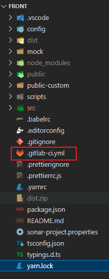

---
markdown:
  path: README.md
  ignore_from_front_matter: true
  absolute_image_path: false
export_on_save:
  markdown: true
---
# Gitlab-CI/CD (配置针对大B端前端)

***前提: 部署的机器可通外网以及访问内部的gitlab***

## 一、新建`.gitlab-ci.yml`

第一种: 在项目主分支(main/master)的根目录新建`.gitlab-ci.yml`并写入下面的内容并提交



第二种: 在gitlab的流水线编辑器里写入下面的内容


@import "./.gitlab-ci.yml"

gitlab仓库设置里配置一下几个变量


## 二、配置runner(远程容器)和nodejs(nvm)

在本地拉取代码`git clone http://gitlab.chihttnacsci.com/test-gitlab-cicd/centos7-docker-gitlab-runner.git` 


获取gitlab_url和token


修改`scripts/centos7_install_docker.sh`里的变量


@import "./scripts/centos7_install_docker.sh"

到`centos7-docker-gitlab-runner` 文件夹的上一级将该目录上传到服务器上

```bash
# scp 要上传的目录 用户名@ip:目标地址
scp -r centos7-docker-gitlab-runner appadmin@172.17.8.195:/home/appadmin
```


输入密码后成功的截图


登录服务器后切换到root用户

```bash
# ssh命令: ssh 用户名@ip
# 切换到root命令: sudo -i
```


cd到`centos7-docker-gitlab-runner/scripts`执行安装脚本

```bash
cd /home/appadmin/centos7-docker-gitlab-runner/scripts && bash ./centos7_install_docker.sh
```

---

## 三、新增runner

(登录服务器进行下面的操作)

1. 同一台服务器的同一个容器里新增runner的情况

```bash
# 变量替换成实际值
docker exec gitlab-runner /bin/bash -c "gitlab-runner register --non-interactive --url ${gitlab_url} --registration-token ${token} --executor 'shell' --description ${description}"
# 开发环境(nodejs和ssh)就不需要重新配置
```

1. 同一台服务器不同容器的情况

```bash
# 新开一个容器--name需要换成跟已经存在的容器名不一样的
docker run -itd --restart=always --name gitlab-runner1 \
-v /root/gitlab-runner/config:/etc/gitlab-runner \
-v /var/run/docker.sock:/var/run/docker.sock  gitlab/gitlab-runner
# 后续注册和配置环境
docker exec gitlab-runner1 /bin/bash -c "gitlab-runner register --non-interactive --url ${gitlab_url} --registration-token ${token} --executor 'shell' --description ${description}"
docker exec -u gitlab-runner gitlab-runner1 /bin/bash -c "git clone https://gitee.com/mirrors/nvm ~/.nvm"
docker cp ../assets/.bashrc gitlab-runner1:/home/gitlab-runner/.bashrc
docker exec -u gitlab-runner gitlab-runner1 /bin/bash -c "source ~/.bashrc && nvm install ${nodejs_version} && nvm use ${nodejs_version} && npm i -g yarn"
```

1. 不同服务器重新跑脚本
2. 根据公司提供的服务器性能,个人建议不要在同一台服务器配太多个runner,因为当同时有多个runner在执行作业时服务器内存不够会自动把后端java服务干掉

---