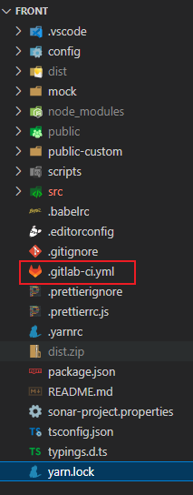

# Gitlab-CI/CD (针对大B端前端-自行改ip和路径)

## 准备

参考: 

[Run GitLab Runner in a container | GitLab](https://docs.gitlab.com/runner/install/docker.html)

公司虚拟机发行版: CentOS Linux release 7.9.2009




本地测试机: centos:7(docker)

```bash
docker run -itd -v C:\Users\kk\Documents\zzsz\centos7-docker-gitlab-runner:/root/centos7-docker-gitlab-runner --privileged --name test-centos-gitlab-cicd centos:7 init
# --privileged 特权模式
# init 可运行systemctl等命令
```


可ping通内网gitlab


## 一、服务器创建脚本（备份-解压）

```bash
# /data/web/setup.sh
time=`date +%y%m%d%H%M` # 获取当前时间并格式化
newdir=`mv platform platform${time}` # 备份
$newdir # 运行命令
unzip dist.zip # 解压
mv dist platform # 重命名
```

## 二、新建.gitlab-ci.yml

```yaml
stages:
  - build

before_script:
  - echo "+++++++++++++++++++++ 开始构建 +++++++++++++++++++++++++++++++++"
  - source ~/.bashrc

build-job:
  stage: build
  only:
    - main
  tags:
    - sit
  script:
    - yarn
    - echo "=============================== 开始打包 ======================================== "
    - yarn build
    - ls
    - echo "=============================== 打包完成 ======================================== "
    - zip -r dist.zip dist # 压缩
    - scp dist.zip appadmin@172.17.8.195:/data/web/sxzq # 上传
    - ssh appadmin@172.17.8.195 "cd /data/web/sxzq;sh ./setup.sh" # 执行服务器上的部署脚本
    - echo “=============================== 发布完成 ======================================== ”
  artifacts:
    name: "dist"
    paths: 
      - dist/
```

## 三、配置runner(远程容器)和nodejs(nvm)

公司的服务器一般都是CentOS7

```bash
# /script/centos7_install_docker.sh

#! /bin/bash -ex

gitlab_url="http://gitlab1.chinacscs.com/"
token="GR1348941FRE_FVWBKkdG_H8rbmN2"
description="XX项目"

if [$(yum list installed | grep docker | awk '{print $1}' | xargs) -eq ""]
then 
    echo "无旧版本"
else 
    echo "============================ 开始删除旧版本 =============================="
    yum -y remove $(yum list installed | grep docker | awk '{print $1}' | xargs)
    echo "============================ 删除旧版本完成 =============================="
fi

echo "============================ 开始设置yum下载docker的国内源 =============================="
yum-config-manager \
    --add-repo \
    http://mirrors.aliyun.com/docker-ce/linux/centos/docker-ce.repo
echo "============================ 已设置国内源(aliyun) =============================="

echo "============================ 开始安装docker =============================="
yum -y install docker-ce docker-ce-cli containerd.io docker-compose-plugin
echo "============================ docker已安装 =============================="

echo "============================ 启动docker服务 =============================="
systemctl start docker
echo "============================ docker服务已启动 =============================="

echo "============================ 开始拉取gitlab/gitlab-runner镜像 =============================="
docker pull gitlab/gitlab-runner
echo "============================ 拉取镜像完成 =============================="

echo "============================ 运行容器 =============================="
docker run -itd --restart=always --name gitlab-runner \
-v /root/gitlab-runner/config:/etc/gitlab-runner \
-v /var/run/docker.sock:/var/run/docker.sock  gitlab/gitlab-runner
echo "============================ 容器已运行 =============================="

echo "============================ 开始注册runner =============================="
docker exec gitlab-runner /bin/bash -c "gitlab-runner register --non-interactive --url ${gitlab_url} --registration-token ${token} --executor 'shell' --description ${description}"
echo "============================ 注册runner完成 =============================="

echo "============================ 给用户gitlab-runner安装nvm(nodejs) =============================="
docker exec -u gitlab-runner gitlab-runner /bin/bash -c "git clone https://gitee.com/mirrors/nvm ~/.nvm"
docker cp ../assets/.bashrc gitlab-runner:/home/gitlab-runner/.bashrc
docker exec -u gitlab-runner gitlab-runner /bin/bash -c "source ~/.bashrc && nvm install 16.13.0 && nvm use 16.13.0"
echo "============================ nvm(nodejs)安装完成 =============================="
```

## 四、给gitlab-runner用户配置ssh密钥

```bash
docker exec -it -u gitlab-runner gitlab-runner /bin/bash
# ssh密钥
ssh-keygen -t rsa -C "kkbdsg"
ssh-copy-id -i ~/.ssh/id_rsa.pub sxzq@172.17.8.195
```